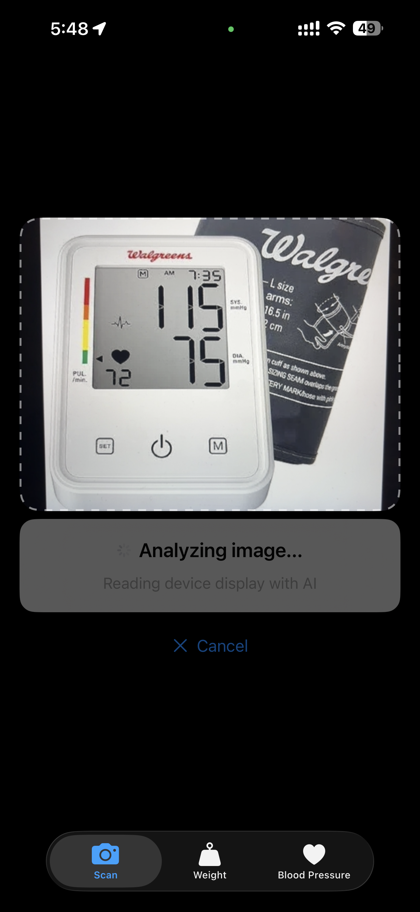
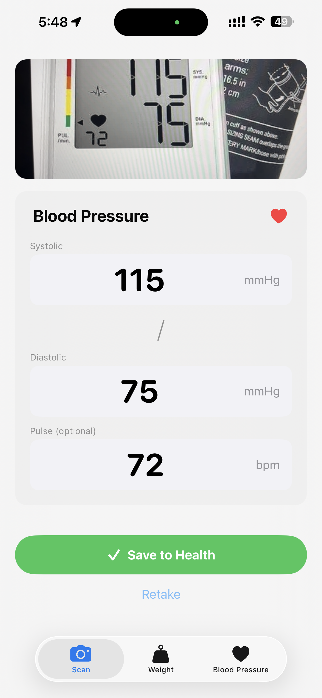
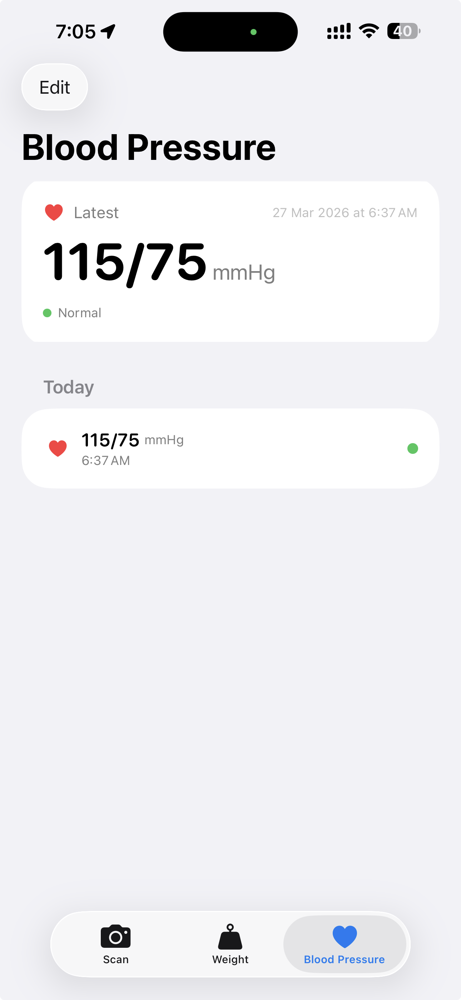

# HealthRead : ML based Health Logger

> On-device logger which takes an image of your blood pressure monitor and logs the reading to HealthKit.
> 
<table>
  <tr>
    <td></td>
    <td></td>
    <td></td>
    <td></td>
  </tr>
  <tr>
    <td align="center">Live detection</td>
    <td align="center">Analyzing</td>
    <td align="center">Confirm reading</td>
    <td align="center">BP history</td>
  </tr>
</table>

---

## Overview

Point your iPhone camera at a blood pressure monitor or weight scale. MobileCLIP-S0 runs entirely on-device at **2.1 ms per frame**, detecting the device type in real time with zero-shot image–text cosine similarity. Once confident, a single JPEG is sent to a off-device Gemini model which returns structured readings (systolic, diastolic, pulse, or weight) via a typed JSON schema. The reading is then saved directly to **Apple Health**, so no third-party servers store your health data.

The app can also use on-device VNRecognizeTextRequest for OCR for total privacy, however that model is often inaccuarate and poorly optmised for reading seven segment displays.

In future, would like to replace with on-device Apple Foundation Models once Apple unrestricts vision input.

---

## ML / AI Pipeline

**Why two stages?** MobileCLIP runs every frame to gate the expensive API call — no cloud traffic until a health device is actually in frame. Privacy-first: only one still image ever leaves the device.

### Stage 1: Detection with MobileCLIP-S0 (CoreML)

| Detail | Value |
|--------|-------|
| Model format | CoreML `.mlpackage` |
| Image encoder input | 256 × 256 RGB |
| Embedding dimension | 256 |
| Inference latency | ~2.1 ms (Neural Engine) |
| Zero-shot ImageNet top-1 | 67.8% |
| Text tokenizer | GPT-2 BPE, 49,152 vocab, 77-token context |

- Similarity threshold tuned empirically; visual feedback (green border pulse) at ≥ 0.22

### Stage 2: Multiple Options for Inference

Currently configured to use an off-device Gemini model for OCR.

However, we can use on-device `VNRecognizeTextRequest` for OCR, however this is often inaccuarate and poorly optmised for reading seven segment displays.

In future,  would like to replace with on-device Apple Foundation Models once Apple unrestricts vision input.

---

## Tech Stack

| Layer | Technology |
|-------|-----------|
| UI | SwiftUI (declarative, no UIKit except camera bridge) |
| Camera | AVFoundation: `AVCaptureSession` + `AsyncStream<CVPixelBuffer>` |
| ML inference | CoreML + custom GPT-2 BPE tokenizer in pure Swift |
| Cloud AI | Gemini 2.5 Flash-Lite (structured JSON output) |
| Health data | HealthKit (`HKCorrelation` for BP, `HKQuantitySample` for weight) |
| Concurrency | Swift actors, `async`/`await`, `AsyncStream`, `AsyncFactory<T>` |
| Storage fallback | Local JSON (Codable) for simulator / restricted environments |
| Dependencies | **Zero**, no Swift Package Manager dependencies |

---

## Getting Started

**Requirements:** Xcode 15+, iOS 17.2+ device, Gemini API key

1. Clone the repo and open `HealthRead.xcodeproj`
2. Download the MobileCLIP-S0 CoreML models from [Hugging Face]([https://huggingface.co/apple/coreml-mobileclip](https://huggingface.co/apple/coreml-mobileclip/tree/main)) and place them in `HealthRead/Models/` : 
   - `mobileclip_s0_text.mlpackage`
   - `mobileclip_s0_image.mlpackage`
3. Add your Gemini API key to either:
   - Create `Build.xcconfig` with `GEMINI_API_KEY = your_key_here`, or
   - Add a `Secrets.plist` with key `GeminiAPIKey`
4. Build and run on a physical device (HealthKit and camera require real hardware)

---

## Credits

- **MobileCLIP** model weights by [Apple Research](https://github.com/apple/ml-mobileclip)
